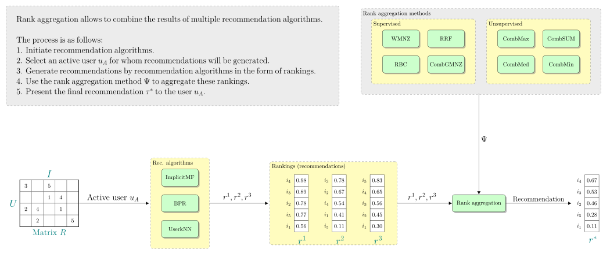

[WIP] In free time I will add more informations.

# What is Rank Aggregation?
As pointed out in [Aggarwal, C.C. (2016). Advanced Topics in Recommender Systems (page 417)](https://doi.org/10.1007/978-3-319-29659-3_13), this is a relatively unexplored approach in the context of recommendation systems, where instead of a single algorithm, a certain set of algorithms is used that generate recommendations for a given user, and then the results of these algorithms are aggregated to create a new recommendation. Aggregation is not a trivial problem, as there is no single universal method for combining such rankings.

I have created a simple figure to demonstrate this process:

# Where to start?
From [this](https://vene.ro/blog/kemeny-young-optimal-rank-aggregation-in-python.html) great blog post.

Next, I think it is worth reading these three publications:
* [Rank aggregation methods for the Web](https://dl.acm.org/doi/10.1145/371920.372165)
* [RankAggreg, an R package for weighted rank aggregation](https://cran.r-project.org/web/packages/RankAggreg/vignettes/RankAggreg.pdf)
* [Is Rank Aggregation Effective in Recommender Systems? An Experimental Analysis](https://doi.org/10.1145/3365375)

# Software:

There are some excellent libraries written in Python and R which can help you.

## Python
* [Ranx](https://github.com/AmenRa/ranx) - A Blazing-Fast Python Library for Ranking Evaluation, Comparison, and Fusion.
* [Ranky](https://github.com/Didayolo/ranky) - Another good library for ranking problem written in Python.
* [RecRankAgg](https://github.com/mbalchanowski/RecRankAgg) - Easy to use rank aggregation software for recommendation systems.
* [MC4](https://github.com/kalyaniuniversity/MC4) - An implementation of Markov Chain Type 4 Rank Aggregation algorithm in Python.
* [Kemeny_ranking](https://github.com/sschnug/kemeny_ranking) - (Exact) Kemeny rank-aggregation using Integer-Programming with Python.
* [ERA](https://github.com/samuevan/ERA) - This repository contains the implementation of the Evolutionary Rank Aggregation (ERA) method proposed in [here](https://doi.org/10.1109/CEC.2016.7743803).

## R
* [RankAggreg](https://cran.r-project.org/web/packages/RankAggreg/vignettes/RankAggreg.pdf) - R package for weighted rank aggregation.

# More:
* [Repository about group recommender systems](https://github.com/lucasvinhtran/group-recommender-systems)
